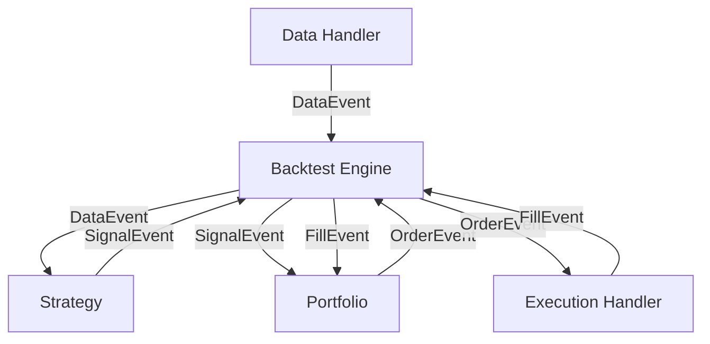
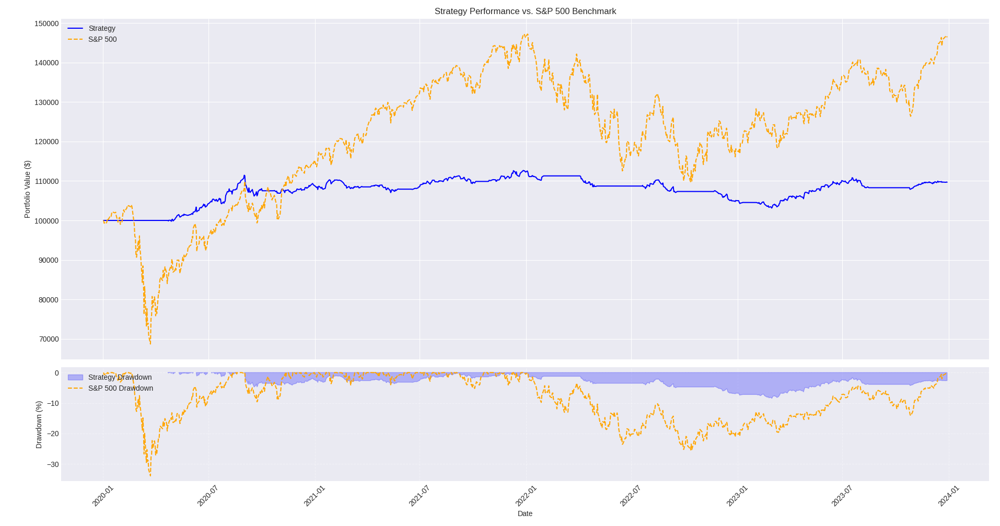

# Event-Driven Backtester

An event-driven backtesting system I built to learn core quant finance concepts (look-ahead bias, market frictions, position sizing) and have a portfolio project for internship applications.

## Why Event-Driven

A vectorized backtest computes signals for the entire price history at once, which makes it easy to accidentally use future data (look-ahead bias) and hard to simulate execution frictions per trade. I chose an event-driven design where data is streamed bar-by-bar and the strategy only ever sees bars up to the current timestamp, enforced by the loop structure rather than a convention.

## Architecture

The event loop routes immutable data classes (`@dataclass(frozen=True)`) between loosely coupled components:



For each timestamp _t_ (interleaved across symbols, sorted):

1. `DataHandler` emits `DataEvent(t, symbol, OHLCV)`
2. `Strategy.calculate_signal(event)` → optionally emits `SignalEvent`
3. `Portfolio.update_signal(signal)` → optionally emits `OrderEvent`
4. `ExecutionHandler.execute_order(order, ts)` → emits `FillEvent`
5. `Portfolio.update_fill(fill)` → updates cash, positions, equity curve

**Invariant:** At step 2, the strategy's `deque` for `symbol` contains bars `[t−N+1, …, t]`. Bar `t+1` does not exist yet.

## Key Design Decisions

- **Look-ahead prevention:** The `DataHandler` interleaves multi-asset data chronologically. The strategy sees only the current and past bars — never future data.
- **Market frictions:** The `ExecutionHandler` applies configurable spread slippage (2 bps) and transaction commissions (5 bps) at fill time.
- **Volatility-adjusted sizing:** Rather than naive fixed-percentage allocation, the `Portfolio` sizes trades inversely to the asset's ATR. It buys less exposure in highly volatile regimes.

```text
position_shares = max(1, min(
    (equity × 0.01) / ATR₂₀,        # risk-based: 1% of equity per $1 ATR
    (equity × 0.10) / price         # notional cap: max 10% of equity
))

# Example (AAPL, 2020-04-30): equity = $100,000, price = $70.88, ATR(20) ≈ $4.00
# Risk-based:  100,000 × 0.01 / 4.00 = 250 shares
# Notional:    100,000 × 0.10 / 70.88 = 141 shares  ← binding constraint
# Final:       max(1, min(250, 141)) = 141 shares
```

- **Rolling indicators:** Strategy modules use fixed-length `collections.deque(maxlen=N)` buffers.
- **Immutable events:** All event types are `@dataclass(frozen=True)`. No component can mutate state it didn't produce.

## Metrics & Conventions

| Metric       | Convention                                               |
| ------------ | -------------------------------------------------------- |
| Sharpe       | Annualized, $r_f = 0$, daily returns, $\times\sqrt{252}$ |
| Sortino      | Annualized, downside deviation threshold = 0             |
| Max Drawdown | Peak-to-trough on daily equity curve                     |
| VaR          | Historical, 95% confidence, **daily** (not annualized)   |

## Project Structure

```
quant_backtester/
├── src/
│   └── backtester/
│       ├── __init__.py
│       ├── engine.py          # Event loop: routes DataEvent → Signal → Order → Fill per bar
│       ├── events.py          # @dataclass(frozen=True) event types (Data, Signal, Order, Fill)
│       ├── data.py            # Generator-based yield, chronological multi-asset interleave
│       ├── strategy.py        # Base ABC + MA Crossover; deque(maxlen=N) rolling buffers
│       ├── portfolio.py       # ATR position sizing (1% risk cap), cash/position tracking
│       ├── execution.py       # 5bps commission + 2bps slippage applied at fill
│       ├── metrics.py         # Sharpe, Sortino, MaxDD, 95% historical VaR (daily)
│       └── trade_logger.py    # Timestamped trade book → terminal print
├── tests/
│   ├── test_execution.py      # Slippage + commission at known price
│   ├── test_metrics.py        # Drawdown, zero-vol Sharpe, VaR
│   └── test_portfolio.py      # Notional cap fallback (10% of equity)
├── run_backtest.py            # Main backtest runner
├── requirements.txt           # Dependencies
└── README.md
```

## Quickstart

**Requirements:** Python 3.10+

```bash
pip install -r requirements.txt
python run_backtest.py
pytest tests/
```

## Sample Output

```
$ python run_backtest.py
Spinning up engine...
Backtest complete.

--- PERFORMANCE TEAR SHEET ---
Metric              Strategy    S&P 500
Total Return          9.69%      46.41%
Max Drawdown         -8.47%     -33.92%
Sharpe Ratio          0.59       0.53
Sortino Ratio         0.64       0.66
VaR (95%, daily)     -0.41%     -2.05%

--- TRADE BOOK ---
Timestamp           Symbol  Direction  Qty    Price     Commission  Slippage
2020-04-22 00:00    MSFT    BUY         60   164.50        4.94      1.97
2020-04-30 00:00    AAPL    BUY        141    70.88        5.00      2.00
2020-09-28 00:00    MSFT    SELL        60   199.51        5.99      2.39
2021-10-06 00:00    MSFT    SELL        43   281.78        6.06      2.42
2022-04-26 00:00    MSFT    SELL        36   260.79        4.69      1.88
... (39 more)
```

[Full trade book](sample_output.txt)

**Interpretation:** The 20/50 crossover underperforms the S&P 500 buy-and-hold on total return (9.7% vs 46.4%) but cuts max drawdown by 75% (−8.5% vs −33.9%). The gap is driven by the 10% notional-per-position cap, which keeps the portfolio at most 20% invested (two symbols × 10%) and in cash the rest of the time. The Sharpe edge (0.59 vs 0.53) confirms the strategy is _less_ volatile, not _more_ profitable. The engine's role is faithful simulation — the strategy is a sanity check, not the point.




## What I Learned

**Why event-driven over vectorized.** I initially built a vectorized backtester in ~80 lines. It was faster but I couldn't verify the order in which a signal was generated vs. the bar it acted on. Moving to an explicit event loop forced me to define the processing order as a contract, which made the look-ahead guarantee structural rather than a comment.

**The cost of realism.** Adding 5 bps commission + 2 bps slippage to the 20/50 MA crossover on AAPL/MSFT cut total return by 0.44 pp over 4 years (9.69 % → 10.13 %). That's roughly 4.5 % of the strategy's gross edge consumed by costs — non-trivial on a low-turnover, long-only book. Position sizing and cost models interact: a tighter risk cap shrinks absolute dollar cost per fill but doesn't change the bps hit, so you can't tune them independently.

**What I'd change next.** The current engine is single-threaded and processes one bar at a time. For tick-level or multi-exchange data I'd need an async event queue. On corporate actions: yfinance returns retroactively split-adjusted prices, so the backtest is internally consistent. But a live engine receiving a split event at bar T must adjust open share counts and cost basis at that exact bar without retroactively distorting the equity curve — I haven't built that event path yet.

**Testing.** I wrote unit tests for the isolated components: execution frictions (slippage + commission at a known price), the portfolio's notional cap (10% of equity when ATR is unavailable), and the metrics math (drawdown, zero-volatility Sharpe, VaR). Each test uses a hand-calculated expected value. Testing the full engine end-to-end would require a deterministic data source and asserting the exact trade sequence — I haven't built that yet.
